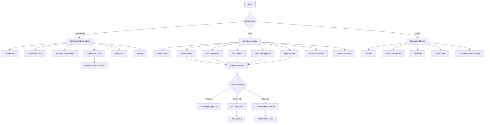
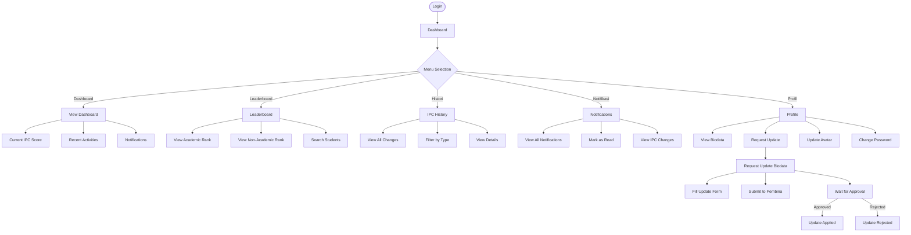
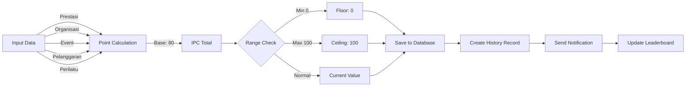
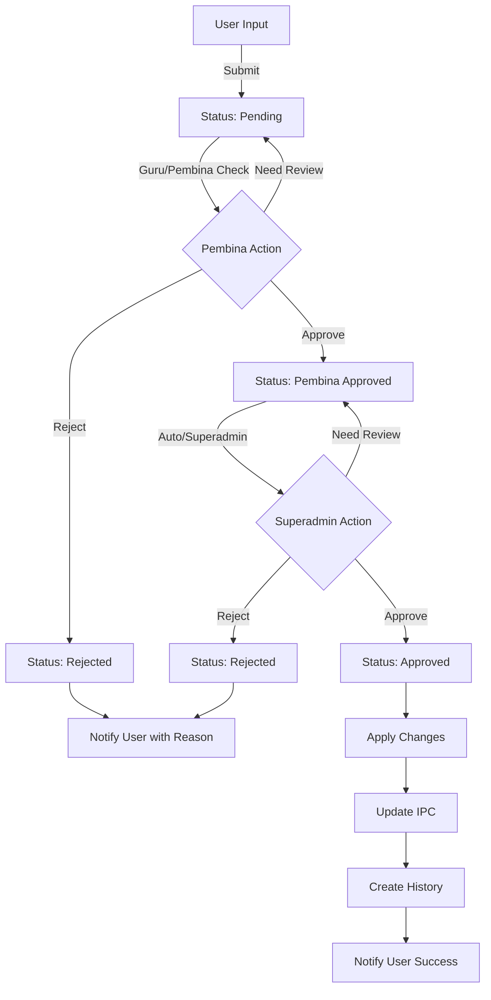

# 📚 IPC School System - Dokumentasi Lengkap

## 📋 System Requirements

### Backend Requirements
```
Node.js >= 16.x
MySQL >= 8.0
npm >= 8.x
```

### Frontend Requirements
```
Node.js >= 16.x
npm >= 8.x
Browser: Chrome/Firefox/Safari/Edge (latest)
```

### Hardware Requirements
```
Minimum:
- RAM: 4GB
- Storage: 10GB
- CPU: 2 cores

Recommended:
- RAM: 8GB+
- Storage: 50GB+
- CPU: 4 cores+
```

---

## 📦 Installation Guide

### 1. Backend Installation

```bash
# Navigate to backend folder
cd backend

# Install dependencies
npm install

# Create .env file from example
copy .env.example .env

# Edit .env with your configuration
# - Database credentials
# - JWT Secret
# - Allowed origins

# Start server
npm start

# Or development mode
npm run dev
```

### 2. Frontend Installation

```bash
# Navigate to frontend folder
cd frontend

# Install dependencies
npm install

# Start development server
npm start

# Build for production
npm run build
```

### 3. Database Setup

```sql
-- Import schema in phpMyAdmin
-- File: backend/database/skema.sql

-- Create database first
CREATE DATABASE ipc_school;
USE ipc_school;

-- Then import the schema
```

---

## 🔐 Default Accounts

| Role | Username | Password |
|------|----------|----------|
| Superadmin | ADMIN001 | admin123 |
| Guru | (NIP guru) | (set by superadmin) |
| Siswa | (NIS/NISN) | (set by guru) |

---

## 📊 System Architecture

### Flowchart: Overall System Flow



---

## 👤 Role-Based Flowcharts

### 1. Superadmin Flow

```mermaid
flowchart TD
    Start([Login]) --> Dashboard
    Dashboard --> Menu{Menu Selection}
    
    Menu -->|Kelola Akun| KA[Kelola Akun]
    KA --> KA1[Create Guru/Siswa]
    KA --> KA2[Edit Account]
    KA --> KA3[Delete Account]
    KA --> KA4[Manage Permissions]
    
    Menu -->|Wali Kelas| WK[Wali Kelas]
    WK --> WK1[Assign Wali Kelas]
    WK --> WK2[View Class Stats]
    WK --> WK3[Remove Assignment]
    
    Menu -->|Approvals| AP[Approvals V2]
    AP --> AP1[View Pending]
    AP --> AP2[Approve/Reject]
    AP --> AP3[View History]
    AP --> AP4[Bulk Actions]
    
    Menu -->|Input Access| IA[Input Access Control]
    IA --> IA1[Enable/Disable Input]
    IA --> IA2[Role-based Access]
    IA --> IA3[Individual Permissions]
    
    Menu -->|Laporan| LP[Laporan & Cetak]
    LP --> LP1[Filter by Class]
    LP --> LP2[Export Excel]
    LP --> LP3[Export PDF]
    LP --> LP4[Export Word]
    
    Menu -->|Logs| LG[Activity Logs]
    LG --> LG1[View All Activities]
    LG --> LG2[Filter by User/Date]
    LG --> LG3[Export Logs]
    
    Menu -->|Profile| PR[Profile]
    PR --> PR1[View Profile]
    PR --> PR2[Update Avatar]
    PR --> PR3[Change Password]
    
    Menu -->|Drive| DR[Google Drive]
    DR --> DR1[View Files]
    DR --> DR2[Manage Links]
    DR --> DR3[Auth Settings]
```



### 2. Guru (Teacher) Flow

```mermaid
flowchart TD
    Start([Login]) --> Dashboard
    Dashboard --> Menu{Menu Selection}
    
    Menu -->|Kelola Siswa| KS[Kelola Siswa]
    KS --> KS1[Create Siswa Account]
    KS --> KS2[Edit Siswa Data]
    KS --> KS3[Delete Siswa]
    KS --> KS4[View Siswa List]
    
    Menu -->|Input Prestasi| IP[Input Prestasi]
    IP --> IP1[Select Siswa]
    IP --> IP2[Fill Prestasi Form]
    IP --> IP3[Upload Bukti]
    IP --> IP4[Submit for Approval]
    
    Menu -->|Input Organisasi| IO[Input Organisasi]
    IO --> IO1[Select Siswa]
    IO --> IO2[Fill Organisasi Form]
    IO --> IO3[Upload Bukti]
    IO --> IO4[Submit for Approval]
    
    Menu -->|Input Event| IE[Input Event]
    IE --> IE1[Select Siswa]
    IE --> IE2[Fill Event Form]
    IE --> IE3[Upload Bukti]
    IE --> IE4[Submit for Approval]
    
    Menu -->|Input Pelanggaran| IPL[Input Pelanggaran]
    IPL --> IPL1[Select Siswa]
    IPL --> IPL2[Fill Pelanggaran Form]
    IPL --> IPL3[Point Reduction]
    IPL --> IPL4[Submit for Approval]
    
    Menu -->|Input Perilaku| IPR[Input Perilaku]
    IPR --> IPR1[Select Siswa]
    IPR --> IPR2[Fill Perilaku Form]
    IPR --> IPR3[Point Addition]
    IPR --> IPR4[Submit for Approval]
    
    Menu -->|Approvals| AP[Pembina Approvals]
    AP --> AP1[View Pending Requests]
    AP --> AP2[Approve/Reject with Notes]
    AP --> AP3[View History]
    
    Menu -->|Wali Kelas| WK[Teacher Wali Kelas]
    WK --> WK1[View My Class]
    WK --> WK2[View Class Statistics]
    WK --> WK3[View Siswa Details]
    WK --> WK4[Print Class Report]
    
    Menu -->|Laporan| LP[Laporan Cetak]
    LP --> LP1[View Reports]
    LP --> LP2[Export Data]
    
    Menu -->|Profile| PR[Profile]
    PR --> PR1[View/Edit Profile]
    PR --> PR2[Update Avatar]
```



### 3. Siswa (Student) Flow



---

## 🔄 Data Flow Diagrams

### IPC Calculation Flow



### Approval Workflow



---

## 📁 File Structure

```
ipc-school/
├── backend/
│   ├── config/
│   │   └── database.js
│   ├── middleware/
│   │   ├── auth.js
│   │   └── security.js
│   ├── routes/
│   │   ├── auth.js
│   │   ├── users.js
│   │   ├── prestasi.js
│   │   ├── organisasi.js
│   │   ├── event.js
│   │   ├── pelanggaran.js
│   │   ├── perilaku.js
│   │   ├── approvals.js
│   │   ├── approvals-v2.js
│   │   ├── dashboard.js
│   │   ├── profile.js
│   │   ├── reports.js
│   │   ├── waliKelas.js
│   │   ├── search.js
│   │   ├── logs.js
│   │   ├── permissions.js
│   │   ├── input-access.js
│   │   └── drive-*.js
│   ├── uploads/
│   │   └── avatars/
│   ├── .env
│   ├── .env.example
│   ├── server.js
│   ├── package.json
│   └── database/
│       └── skema.sql
├── frontend/
│   ├── public/
│   ├── src/
│   │   ├── components/
│   │   │   ├── Login.js
│   │   │   ├── Dashboard.js
│   │   │   ├── Navbar.js
│   │   │   ├── Profile.js
│   │   │   ├── InputPrestasi.js
│   │   │   ├── InputOrganisasi.js
│   │   │   ├── InputEvent.js
│   │   │   ├── InputPelanggaran.js
│   │   │   ├── InputPerilaku.js
│   │   │   ├── KelolaAkun.js
│   │   │   ├── KelolaSiswa.js
│   │   │   ├── IzinAkun.js
│   │   │   ├── Leaderboard.js
│   │   │   ├── WaliKelas.js
│   │   │   ├── TeacherWaliKelas.js
│   │   │   ├── ApprovalsV2.js
│   │   │   ├── PembinaApprovals.js
│   │   │   ├── LaporanCetak.js
│   │   │   ├── Logs.js
│   │   │   ├── Notifications.js
│   │   │   └── DriveViewer.js
│   │   ├── config.js
│   │   ├── index.js
│   │   └── index.css
│   ├── package.json
│   └── .env
├── DOCUMENTATION.md
└── README.md
```

---

## 🔧 Dependencies List

### Backend Dependencies
| Package | Version | Purpose |
|---------|---------|---------|
| express | ^4.18.2 | Web framework |
| mysql2 | ^3.6.5 | Database driver |
| bcryptjs | ^2.4.3 | Password hashing |
| jsonwebtoken | ^9.0.2 | JWT authentication |
| cors | ^2.8.5 | Cross-origin requests |
| dotenv | ^16.3.1 | Environment variables |
| multer | ^1.4.5 | File upload handling |
| express-validator | ^7.0.1 | Input validation |
| helmet | ^7.1.0 | Security headers |
| express-rate-limit | ^7.1.5 | Rate limiting |
| express-slow-down | ^2.0.1 | Speed limiting |

### Frontend Dependencies
| Package | Version | Purpose |
|---------|---------|---------|
| react | ^18.2.0 | UI library |
| react-router-dom | ^6.x | Routing |
| axios | ^1.x | HTTP client |
| xlsx | ^0.18.x | Excel export |
| jspdf | ^2.x | PDF export |
| jspdf-autotable | ^3.x | PDF tables |
| aos | ^2.x | Animations |

---

## 🚀 Deployment Checklist

### Pre-Deployment
- [ ] Change JWT_SECRET to strong random string
- [ ] Update database credentials
- [ ] Set NODE_ENV=production
- [ ] Configure ALLOWED_ORIGINS
- [ ] Enable HTTPS
- [ ] Test all features
- [ ] Run security audit: `npm audit`
- [ ] Build frontend: `npm run build`

### Security
- [ ] Disable CORS wildcard in production
- [ ] Enable rate limiting
- [ ] Configure security headers
- [ ] Set up HTTPS certificates
- [ ] Enable firewall rules
- [ ] Regular backups configured

### Monitoring
- [ ] Activity logs enabled
- [ ] Error tracking setup
- [ ] Performance monitoring
- [ ] Database backups scheduled

---

## 📞 Support & Maintenance

### Regular Maintenance Tasks
1. **Daily**: Check activity logs for suspicious actions
2. **Weekly**: Review pending approvals
3. **Monthly**: Backup database
4. **Quarterly**: Update dependencies, rotate secrets

### Troubleshooting
| Issue | Solution |
|-------|----------|
| Login fails | Check JWT_SECRET, database connection |
| Avatar not loading | Check CORS headers, upload folder permissions |
| Export fails | Check xlsx/jspdf dependencies |
| Database error | Check MySQL service, credentials |
| 404 errors | Check API routes, baseURL config |

---

**Document Version**: 1.0
**Last Updated**: May 8, 2026
**System Version**: IPC School System v1.0
